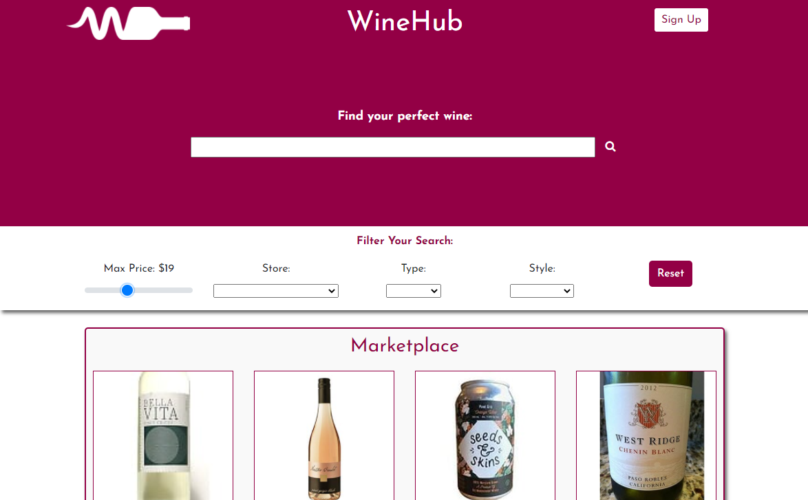

# WineHub

MERN eCommerce solution for small wine retailers. The application allows retailers to upload / manage product inventory and consumers to search, filter and purchase from a marketplace to find their perfect wine.

[View Application](https://vast-river-22849.herokuapp.com/)

[View Project Repo](https://github.com/grburner/project-3)

## How to use

- Consumer:
    * Type in a search and click the search icon
    * Adjust filters for price, store, type and style
    * Click a product to view more details
    * Purchase a product
- Retailer:
    * Sign up or login as a retailer to access the portal
    * Click *+ Add Product* to add inventory. Fill out product details and upload an image
    * To view and modify your inventory, change the values in the *Your Products* table and click *Save*
    * View your orders under *Your Orders*. Click the icon under *Info* to view more details about an order

## Languages and Frameworks Used:
- [Mongo](https://www.mongodb.com/) / [Mongoose](https://mongoosejs.com/)
- [Express](https://expressjs.com/) / [Express Session](https://www.npmjs.com/package/express-session)
- [React.js](https://reactjs.org/)
- [Node.js](https://nodejs.org/en/)
- [Eslint](https://eslint.org/)
- [Passport / Bcrypt](https://www.npmjs.com/package/passport)
- [Morgan](https://www.npmjs.com/package/morgan)
- [Cloudinary Media API](https://cloudinary.com/)
- [GitHub](https://github.com/) / [Heroku](https://www.heroku.com/) / [MongoDB Atlas](https://www.mongodb.com/cloud/atlas)

## Team
All members of the team worked together across the full stack application 
- [James Ravelle](https://github.com/jamesravelle) - Consumer Facing Front End
- [Gary Burner](https://github.com/grburner) - Retailer Facing Front End
- [Christina Bayley](https://github.com/cbayley-edu) - Back End and Database